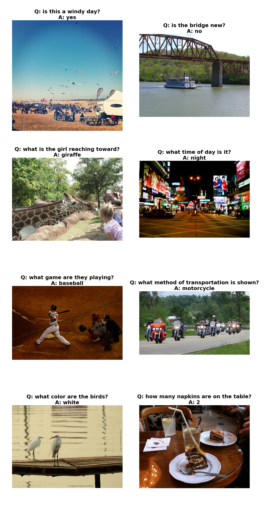

### Introduction
This neural system for visual question answering is roughly based on the paper "Dynamic Memory Networks for Visual and Textual Question Answering" by Xiong et al. (ICML2016). The input is an image and a question about the image, and the output is a one-word answer to this question. It uses a convolutional neural network to extract visual features from the image, and uses a bi-directional GRU recurrent neural network to fuse these features. Meanwhile, it uses either a GRU recurrent neural network or a positional encoding scheme to encode the question. Then, it utilizes a dynamic memory network with an attention mechanism to generate the answer based on this information. This project is implemented using the Tensorflow library, and allows end-to-end training of both CNN and RNN parts.

### Prerequisites
* **Tensorflow** ([instructions](https://www.tensorflow.org/install/))
* **NumPy** ([instructions](https://scipy.org/install.html))
* **OpenCV** ([instructions](https://pypi.python.org/pypi/opencv-python))
* **Natural Language Toolkit (NLTK)** ([instructions](http://www.nltk.org/install.html))
* **Pandas** ([instructions](https://scipy.org/install.html))
* **Matplotlib** ([instructions](https://scipy.org/install.html))
* **tqdm** ([instructions](https://pypi.python.org/pypi/tqdm))

### Usage
* **Preparation:** Download and extract the COCO train2014 and val2014 images  [here](http://cocodataset.org/#download). Put the COCO train2014 images in the folder `train/images`, and put the COCO val2014 images in the folder `val/images`. Download and extract the VQA v1 training and validation questions and annotations [here](http://www.visualqa.org/vqa_v1_download.html). Put the file `mscoco_train2014_annotations.json` and `OpenEnded_mscoco_train2014_questions.json` in the folder
`train`. Similarly, put the file `mscoco_val2014_annotations.json` and `OpenEnded_mscoco_val2014_questions.json` in the folder
`val`. Furthermore, download and extract the pretrained VGG16 net [here](https://app.box.com/s/idt5khauxsamcg3y69jz13w6sc6122ph) or ResNet50 net [here](https://app.box.com/s/17vthb1zl0zeh340m4gaw0luuf2vscne) if you want to use it to initialize the CNN part.

* **Training:**
To train a model using the VQA v1 training data, first setup various parameters in the file `config.py` and then run a command like this:
```shell
python main.py --phase=train \
    --load_cnn \
    --cnn_model_file='./vgg16_no_fc.npy'\
    [--train_cnn]    
```
Turn on `--train_cnn` if you want to jointly train the CNN and RNN parts. Otherwise, only the RNN part is trained. The checkpoints will be saved in the folder `models`. If you want to resume the training from a checkpoint, run a command like this:
```shell
python main.py --phase=train \
    --load \
    --model_file='./models/xxxxxx.npy'\
    [--train_cnn]
```
To monitor the progress of training, run the following command:
```shell
tensorboard --logdir='./summary/'
```

* **Evaluation:**
To evaluate a trained model using the VQA v1 validation data, run a command like this:
```shell
python main.py --phase=eval --model_file='./models/xxxxxx.npy'
```
The result will be shown in stdout. Furthermore, the generated answers will be saved in the file `val/results.json`.

* **Inference:**
You can use the trained model to answer any questions about any JPEG images! Put such images in the folder `test/images`. Also, create a CSV file containing your questions (this file should have three fields: image, question, question_id), and put it in the folder `test`. Then run a command like this:
```shell
python main.py --phase=test --model_file='./models/xxxxxx.npy'
```
The generated answers will be saved in the folder `test/results`.

### Results
A pretrained model with default configuration can be downloaded [here](https://app.box.com/s/jin3mfwnqblqiozits0xjihc1vqjvb34). This model was trained solely on the VQA v1 training data. It achieves accuracy **60.35%** on the VQA v1 validation data. Here are some successful examples:


### References
* [Dynamic Memory Networks for Visual and Textual Question Answering](https://arxiv.org/abs/1603.01417) Caiming Xiong, Stephen Merity, Richard Socher. ICML 2016.
* [Visual Question Answering (VQA) dataset](http://visualqa.org/)
* [Implementing Dynamic memory networks by YerevaNN](https://yerevann.github.io/2016/02/05/implementing-dynamic-memory-networks/)
* [Dynamic memory networks in Theano](https://github.com/YerevaNN/Dynamic-memory-networks-in-Theano)
* [Dynamic Memory Networks in Tensorflow](https://github.com/therne/dmn-tensorflow)
